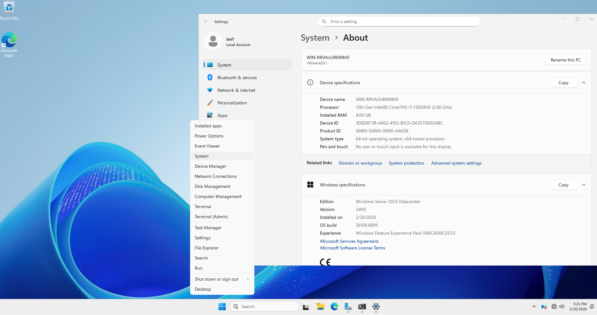
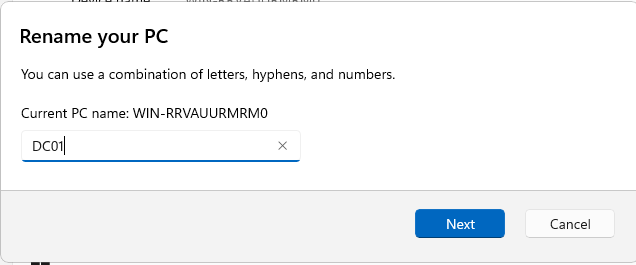
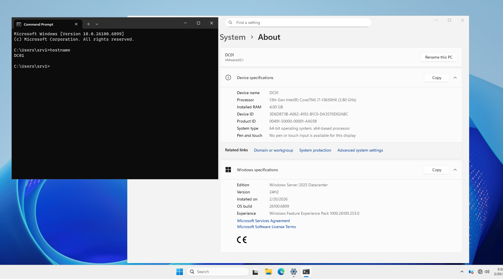
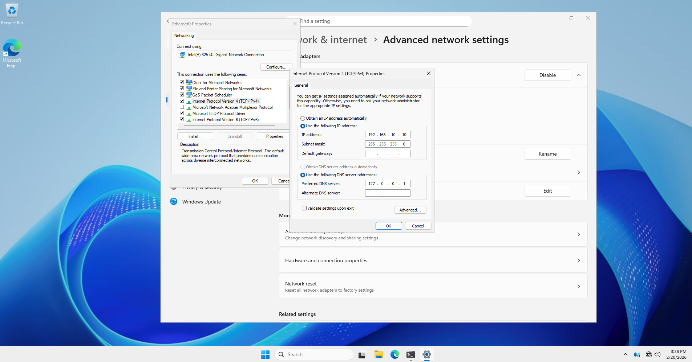
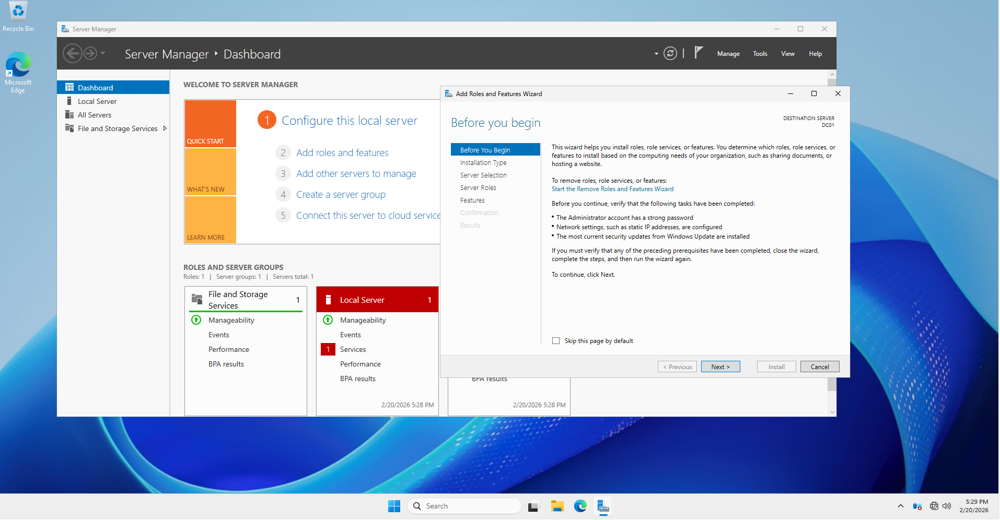
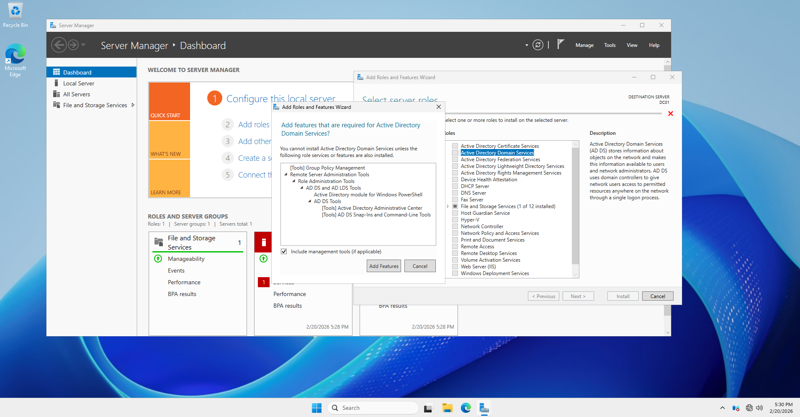
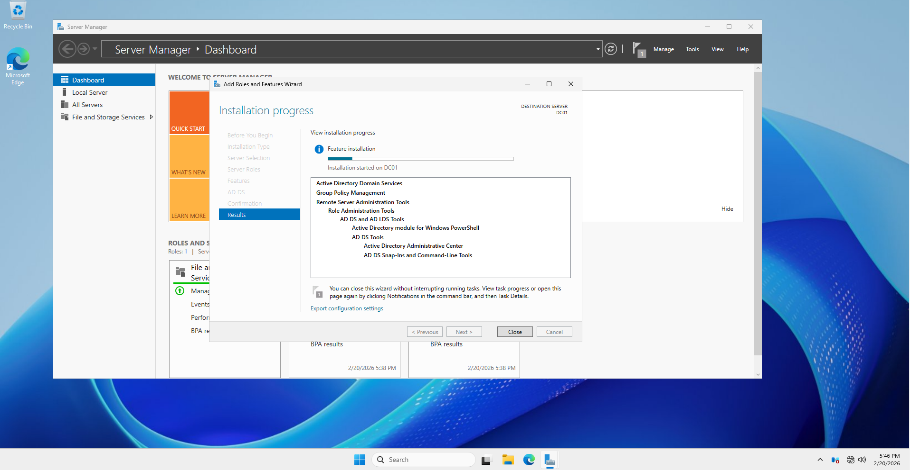

# Lab 01: Build the First Domain Controller (devlab.local)

## 🎯 Objective
Establish the foundation of the **DevLab** infrastructure by promoting the first server to a Domain Controller (DC) and creating a new Forest.


## 💻 Environment Details
| Setting | Configuration |
| :--- | :--- |
| **Hostname** | DC01 |
| **Operating System** | Windows Server 2025 |
| **IP Address** | `192.168.10.10` |
| **Subnet Mask** | `255.255.255.0` |
| **Preferred DNS** | `127.0.0.1` |
| **Forest Name** | `devlab.local` |


## 🚀 Implementation Steps

### Step 1: Prepare the Server
Before promoting, ensure the system is ready:
- [ ] Rename the computer to **DC01**.
- [ ] Assign the static IP address: `192.168.10.10`.
- [ ] Set the DNS server to its own IP or Loopback.

### Step 2: Install AD DS Role
Open **PowerShell** as Administrator and run the following command to install the Active Directory Domain Services role:

```powershell
Install-WindowsFeature -Name AD-Domain-Services -IncludeManagementTools

```
## 🛠 Step 1.1: System Hostname Configuration
It is essential to rename the server before promoting it to a Domain Controller to ensure consistent DNS and AD records.

### Manual Steps (GUI):
1. Right-click the Start button and select System.
2. In the About section, click the Rename this PC button.
 
3. Enter DC01 as the new computer name.
 
4. In the *System Properties* dialog, click **Change**.
5. Click Next and then select Restart Now to apply the changes.
6. Click **OK** and **Restart** the server.

### Verification (PowerShell):
After rebooting, verify the change using the following command:
```powershell
hostname
```
  

Next Step:
Now that the server is named DC01, we need to set the Static IP.
## 🌐 Step 1.2: Network Configuration (Static IP)
A Domain Controller must have a static IP address to ensure that clients and other servers can reliably locate it for authentication and DNS services.

### Manual Steps (GUI):
1. Press `Win + R`, type **ncpa.cpl**, and press **Enter**.
2. Right-click your network adapter (e.g., *Ethernet*) and select **Properties**.
3. Select **Internet Protocol Version 4 (TCP/IPv4)** and click **Properties**.

4. Select **Use the following IP address** and enter the following details:
   - **IP address:** `192.168.10.10`
   - **Subnet mask:** `255.255.255.0`
  
5. Select **Use the following DNS server addresses** and enter:
   - **Preferred DNS server:** `127.0.0.1` (Points to itself)
6. Click **OK** and then **Close**.



### Verification:
Open **Command Prompt** or **PowerShell** and run:
```cmd
ipconfig
```


## 🛠 Step 1.3: Install AD DS Role
In this step, we install the Active Directory Domain Services role using the Server Manager.

### Manual Steps:
1. Open **Server Manager** and click **Manage** > **Add Roles and Features**.

2. On the **Installation Type** screen, select **Role-based or feature-based installation** and click **Next**.
3. Select **DC01** from the server pool and click **Next**.
4. In the **Server Roles** list, check the box for **Active Directory Domain Services**.

5. A popup will appear; click **Add Features** to include the required management tools, then click **Next**.
6. Continue clicking **Next** through the Features and AD DS tabs (keep defaults).
7. On the **Confirmation** screen, click **Install**.



