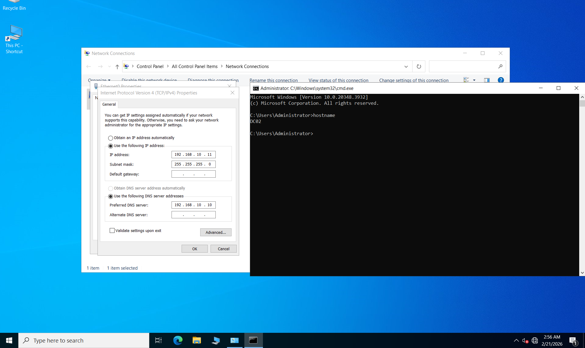
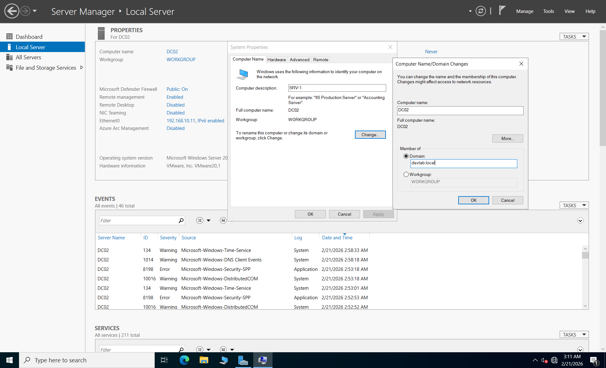
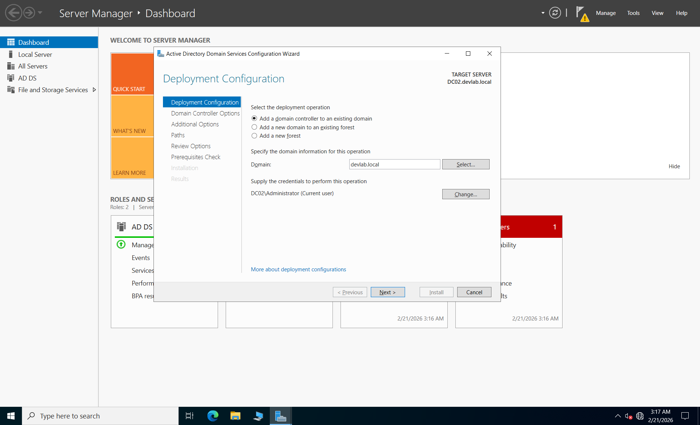
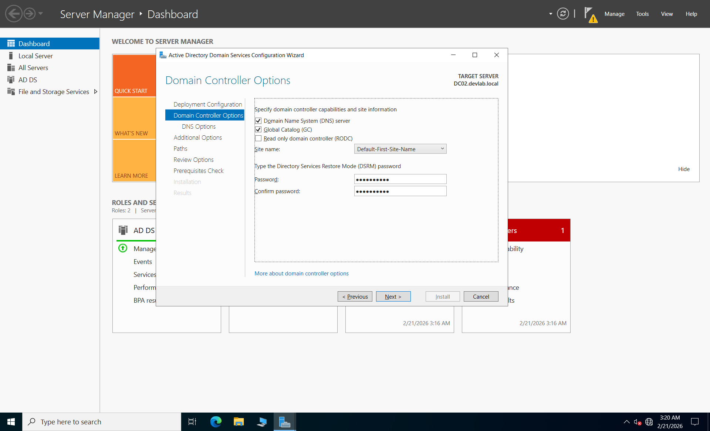

## Step-by-Step Implementation

### 1. Network Configuration
Before joining the domain, the secondary server must be able to communicate with the Primary DC.
- Set the static IP to `192.168.10.11`.
- **Crucial:** Set the **Preferred DNS** to `192.168.10.10`.
- Verify connectivity using `ping 192.168.10.1` and `nslookup devlab.local`.
- 

### 2. Joining the Domain
1. Open **Server Manager** > **Local Server**.
2. Click on **Workgroup**, then select **Change**.
3. Set the Computer Name to `DC02` and join the domain `devlab.local`.
4. Provide the Domain Administrator credentials (`Administrator` / `YourPassword`).
5. Restart the server.

### 3. Installing AD DS Role
1. After rebooting, log in as **DEVLAB\Administrator**.
2. Open **Server Manager** > **Add Roles and Features**.
3. Select **Active Directory Domain Services** and complete the installation wizard.

### 4. Promoting to Domain Controller (The ADC Setup)
1. Click the **Notification Flag** in Server Manager and select **Promote this server to a domain controller**.
2. **Deployment Configuration:** Select **"Add a domain controller to an existing domain"**.

3. **Domain Information:** Ensure `devlab.local` is selected.
4. **Domain Controller Options:** - Ensure **Domain Name System (DNS) server** and **Global Catalog (GC)** are checked.
   - Enter a secure **DSRM Password**.

5. **Additional Options:** Under "Replicate from", select **DC01.devlab.local** to sync the database.
6. Review requirements and click **Install**. The server will reboot automatically.

---

## Verification Tasks
To confirm that the High Availability setup is working:
- **Active Directory Users and Computers:** Check the `Domain Controllers` OU; both `DC01` and `DC02` should be listed.
- **PowerShell:** Run `Get-ADDomainController -Filter * | select Name, IPv4Address, IsGlobalCatalog` to verify both DCs are active.
- **Replication Check:** Run `repadmin /showrepl` to ensure successful synchronization between the two servers.

---
*Note: In a production environment, remember to update the DNS settings on both servers so they point to each other as Secondary DNS for full redundancy.*
