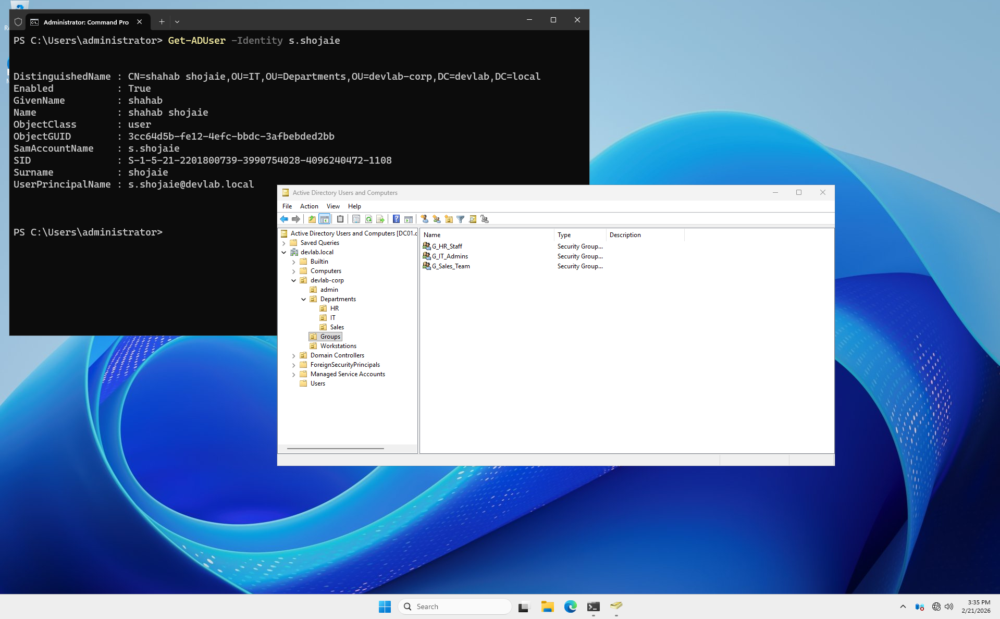

# Lab 04: Step-by-Step OU and User Implementation

## 🎯 Objective
This lab provides a manual, step-by-step guide to building a standardized Organizational Unit (OU) structure and creating user accounts in Windows Server 2025.


## 🏗️ Part 1: Creating the OU Hierarchy (Manual Method)

To keep the Active Directory organized, follow these exact steps:

1. **Open Management Tool:**
   - On **DC01**, open **Server Manager**.
   - Click **Tools** in the top-right corner and select **Active Directory Users and Computers**.

2. **Create the Root OU:**
   - Right-click on your domain (`devlab.local`).
   - Select **New** > **Organizational Unit**.
   - Name: `DevLab-Corp`
   - Ensure the box **"Protect container from accidental deletion"** is checked. Click **OK**.

3. **Create Sub-OUs:**
   - Right-click on the newly created `DevLab-Corp` OU.
   - Select **New** > **Organizational Unit**.
   - Create the following folders one by one:
     - `Admin`
     - `Departments`
     - `Groups`
     - `Workstations`

4. **Create Department Sub-Folders:**
   - Right-click on `Departments` and create:
     - `IT`
     - `HR`
     - `Sales`


## 👥 Part 2: Creating Security Groups

Groups allow us to manage permissions for many users at once.

1. Right-click the `Groups` OU.
2. Select **New** > **Group**.
3. Create the following (Keep Group Scope: **Global** and Group Type: **Security**):
   - `G_IT_Admins`
   - `G_HR_Staff`
   - `G_Sales_Team`


## 👤 Part 3: Creating a User Account

Let's create a test user to verify the structure:

1. Right-click the `IT` OU (under Departments).
2. Select **New** > **User**.
3. Fill in the details:
   - **First Name:** `Shahab`
   - **Last Name:** `Shojaie`
   - **User logon name:** `s.shojaie`
4. Click **Next** and set a password (e.g., `P@ssw0rd2025!`).
5. Select **"User must change password at next logon"**.
6. Click **Finish**.


## 🛠️ Part 4: Assigning User to Group

1. Right-click the new user (`Shahab Shojaie`).
2. Select **Add to a group...**.
3. Type `G_IT_Admins` and click **Check Names**, then **OK**.


## ✅ Verification
Open **PowerShell** as Administrator and run:
```powershell
# Check if the user exists and show their Distinguished Name (Path)
Get-ADUser -Identity s.shojaie | Select-Object Name, DistinguishedName
```



