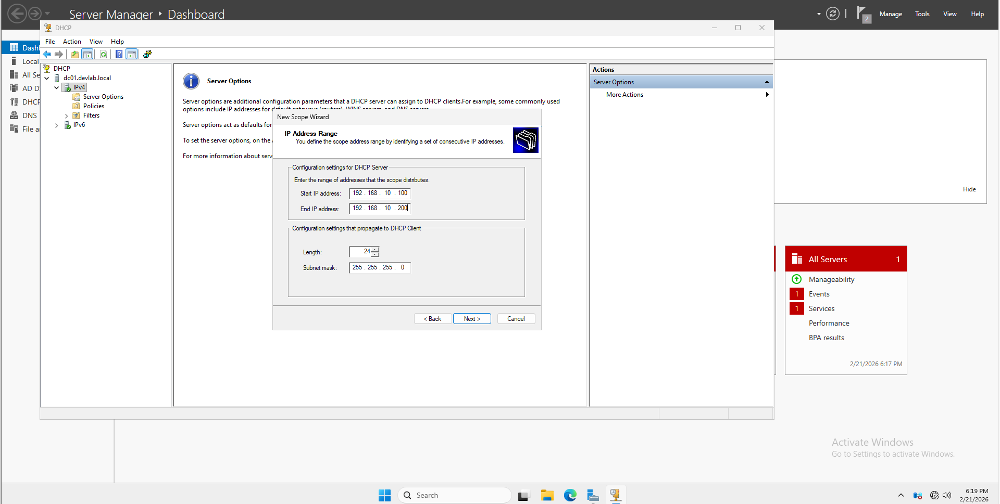
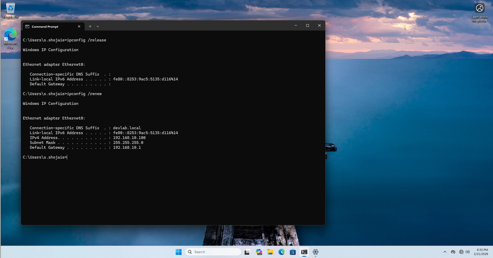

# 🛠️ Lab Implementation: DHCP Scope & High Availability (Failover)

## 📋 Task Overview
This lab demonstrates how to automate IP assignment and ensure network resilience by configuring a DHCP Scope on **DC01** and replicating it to **DC02** using **Failover Load Balance mode**.

##  Phase 1: Installing & Authorizing the DHCP Role

Before configuring scopes, the DHCP server role must be installed and authorized within the Active Directory domain.

### Step 1: Role Installation
1. On **DC01** and **DC02**, open **Server Manager**.
2. Navigate to **Add Roles and Features** > **Role-based or feature-based installation**.
3. Select **DHCP Server** from the server roles list and click **Add Features**.
4. Proceed through the wizard and click **Install**.


### Step 2: Post-Deployment Configuration (Authorization)
1. Once installed, click the **Notifications (Flag icon)** in Server Manager.
2. Select **Complete DHCP Configuration**.
3. On the **Authorization** page, use the **AD Administrator credentials** and click **Commit**.

## 🔧 Step-by-Step Configuration

### 1. Creating the DHCP Scope (DC01)
To manage the client IP addresses, I created a new scope:
1. **Open DHCP Manager:** Start > Windows Administrative Tools > DHCP.
2. **New Scope Wizard:** Right-click **IPv4** > **New Scope**.
3. **Configuration Details:**
   - **Name:** `Enterprise_Client_Pool`
   - **Start IP:** `192.168.10.100`
   - **End IP:** `192.168.10.200`
   - **Subnet Mask:** `255.255.255.0`
4. **Exclusions:** Added `192.168.10.150` to the exclusion list for static network assets (Printers).
5. **Scope Options:**
   - **Router :** `192.168.10.1`
   - **DNS Servers :** `192.168.10.10` (DC01), `192.168.10.11` (DC02).



# DHCP Verification & Client Testing

After configuring the Scope and Failover, I performed a live test using a Windows 11 workstation to ensure the server is correctly distributing IP addresses.

### 1. Client Network Configuration
On the Windows 11 client, I configured the Ethernet adapter to use dynamic addressing:
- **IPv4 Settings:** Set to "Obtain an IP address automatically".
- **DNS Settings:** Set to "Obtain DNS server address automatically".

### 2. Requesting a New IP Lease
I opened the Command Prompt (CMD) on the client and executed the following commands:
```cmd
# Step 1: Release any existing IP address
ipconfig /release

# Step 2: Request a new IP from the DHCP Server
ipconfig /renew
```


### 2. Configuring DHCP Failover (Redundancy)
To satisfy the "No Downtime" requirement, I implemented a Failover relationship between the two Domain Controllers:
1. **Initiate Failover:** Right-click the scope > **Configure Failover**.
2. **Partner Server:** Selected **DC02.devlab.local** (`192.168.10.11`).
3. **Mode:** **Load Balance** (50% Load distribution between both servers).
4. **Authentication:** Set a **Shared Secret** for secure communication between servers.
5. **Completion:** Verified that the scope was automatically replicated to the DHCP console on DC02.


