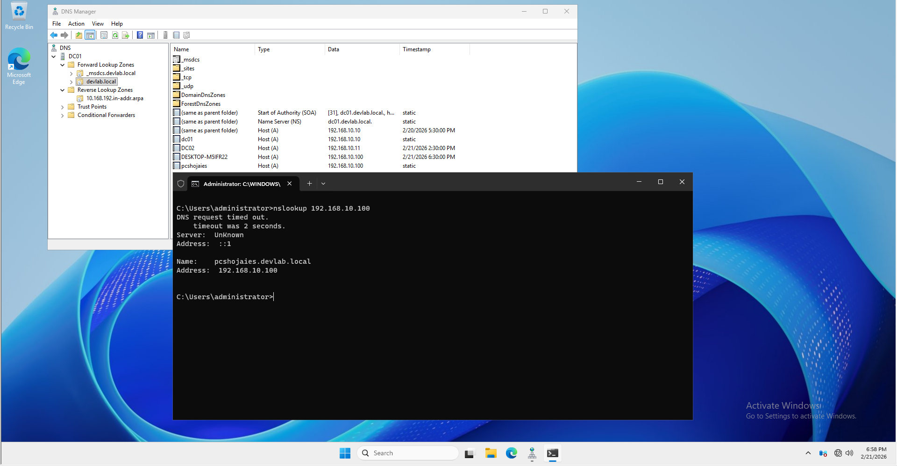

# 🛠️ Implementation & Verification: Step-by-Step DNS Setup

## 📋 Task: Resolve `pcshojaies` to `192.168.10.100`

---

### Step 1: Create a Forward Lookup Record (A-Record)
To map the name `pcshojaies` to the IP address.
1. Open **DNS Manager** on DC01.
2. Go to **Forward Lookup Zones** > `devlab.local`.
3. Right-click and select **New Host (A or AAAA)...**.
4. **Name:** `pcshojaies`
5. **IP Address:** `192.168.10.100`
6. Check **Create associated pointer (PTR) record** (Note: This requires Step 2).
7. Click **Add Host**.

#### ✅ Test 1: Verification of Forward Resolution
- **Action:** Open CMD on the server or any client.
- **Command:** `nslookup pcshojaies.devlab.local`
- **Expected Result:** The server should return `192.168.10.100`.

### Step 2: Create a Reverse Lookup Zone (PTR)
To allow the system to know who `192.168.10.100` is when queried by IP.
1. In DNS Manager, right-click **Reverse Lookup Zones** > **New Zone**.
2. Select **Primary Zone** > **Store in AD**.
3. Choose **IPv4 Reverse Lookup Zone**.
4. **Network ID:** `192.168.10`
5. Finish the wizard.
6. (If the PTR wasn't created in Step 1, go back to the A-Record, open its properties, and check "Update associated pointer record").

#### ✅ Test 2: Verification of Reverse Resolution
- **Action:** Open CMD.
- **Command:** `nslookup 192.168.10.100`
- **Expected Result:** The server should return the name `pcshojaies.devlab.local`.

---

### Step 3: Final Connectivity Test (Ping)
Ensuring the name is reachable over the network.
1. Ensure the device at `192.168.10.100` is online or simulate it.
2. **Command:** `ping pcshojaies`

#### ✅ Test 3: Success Confirmation
- **Result:** If the DNS is working, the ping command will automatically show:
  `Pinging pcshojaies.devlab.local [192.168.10.100] with 32 bytes of data:`
- **Note:** If you get "Request Timed Out" but the IP is correct, it means the firewall is blocking ICMP, but **DNS is working**.
