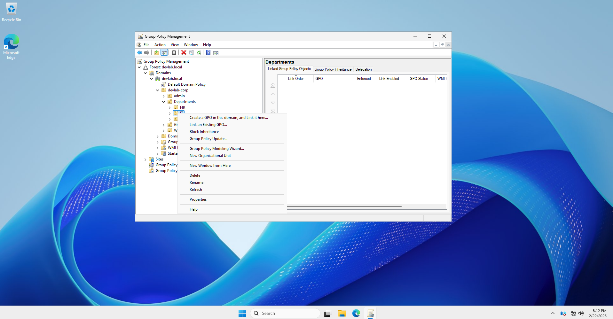
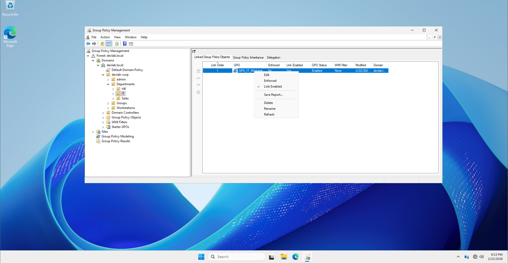
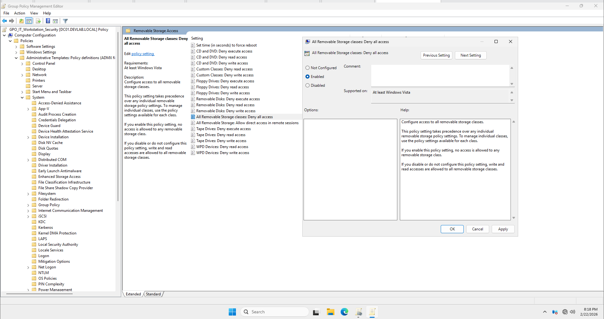
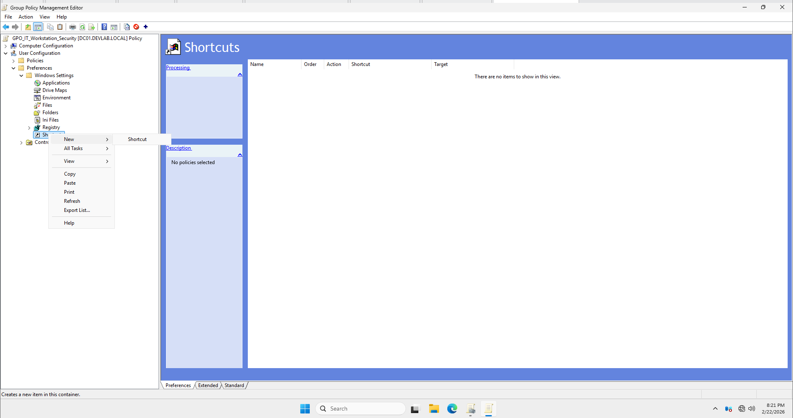
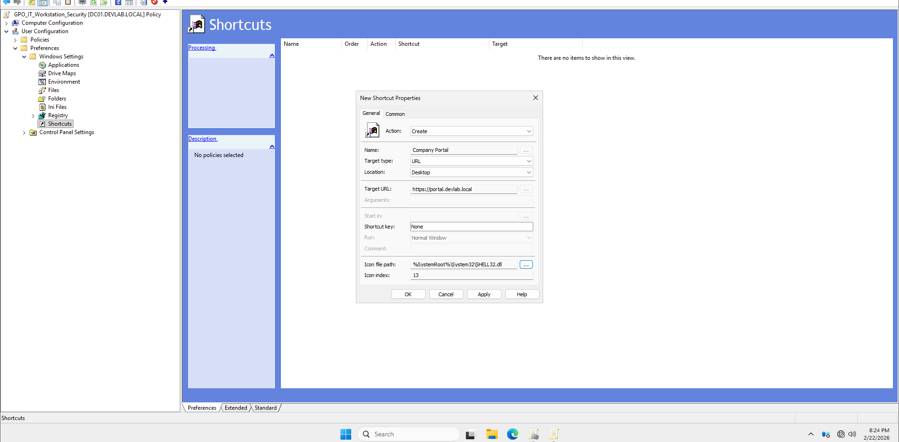
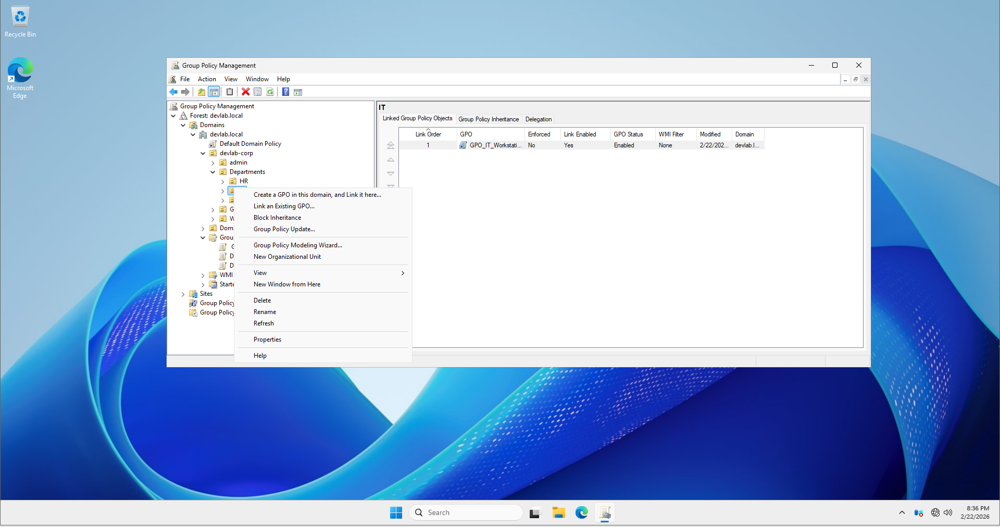
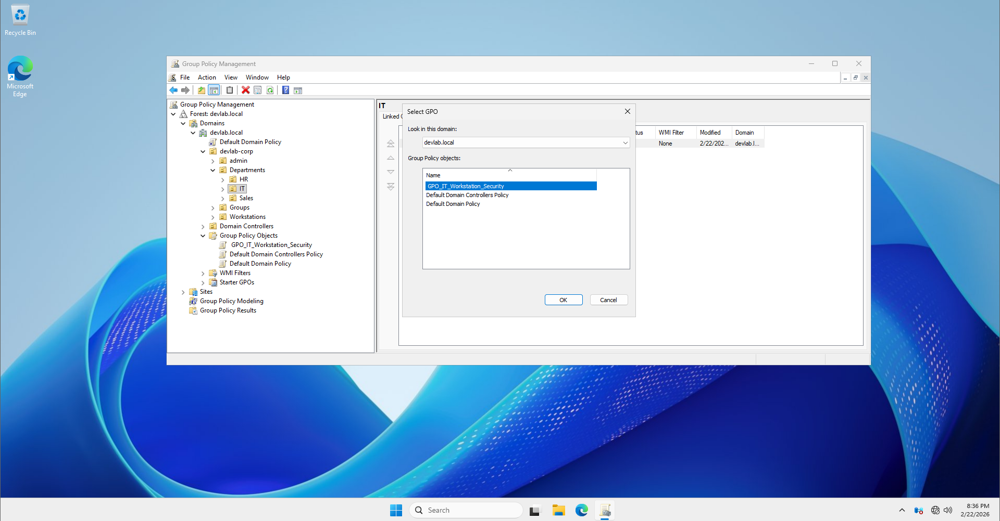
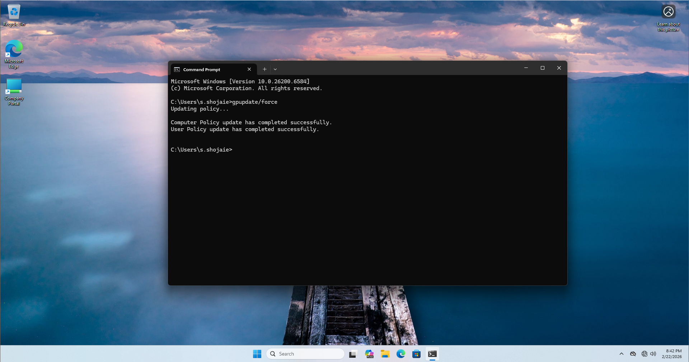

# 🛠️ Step-by-Step Implementation: Scenario 01 (Security & Standardization)

## 📋 Task Overview
- **Objective:** Block USB access and deploy a Desktop Shortcut.
- **Target User:** `s.shojaies` (IT_Staff Group)
- **Target OU:** `IT_Department`

---

## ⚙️ Execution Steps

### Step 1: Create and Link GPO
1. Open **Group Policy Management** (gpmc.msc).
2. Right-click on the **IT_Department** OU.
3. Select **"Create a GPO in this domain, and Link it here..."**.
4. Name the GPO: `GPO_IT_Workstation_Security`.



### Step 2: Configure USB Blocking (Computer Level)
1. Right-click the new GPO and select **Edit**.




2. Navigate to: `Computer Configuration` > `Policies` > `Administrative Templates` > `System` > `Removable Storage Access`.
3. Double-click **All Removable Storage classes: Deny all access**.
4. Set it to **Enabled**, then click **OK**.



### Step 3: Configure Desktop Shortcut (User Level)
1. In the same Editor, navigate to: `User Configuration` > `Preferences` > `Windows Settings` > `Shortcuts`.
2. Right-click in the workspace and select **New** > **Shortcut**.




3. Fill in the details:
   - **Action:** `Update`
   - **Name:** `Company Portal`
   - **Target Type:** `URL`
   - **Location:** `Desktop`
   - **Target URL:** `https://portal.devlab.local`
4. Click **OK**.



### Step 4: Security Filtering (Optional but Recommended)
1. Select the GPO in the Management Console.
2. Under the **Scope** tab, go to **Security Filtering**.
3. Remove `Authenticated Users`.
4. Add the `IT_Staff` security group to ensure it only affects IT personnel.

---


# 🔗 Technical Guide: Linking GPOs to Organizational Units (OUs)

## 📝 Concept
Creating a GPO is only the first half of the process. For the settings to take effect, the GPO must be **Linked** to the specific OU where the target users or computers reside.

---

## ⚙️ Implementation Steps

### Step 1: Linking the GPO
1. Open **Group Policy Management** (gpmc.msc).
2. Expand your domain (e.g., `devlab.local`).
3. Locate the **IT_Department** OU.
4. **Right-click** on the `IT_Department` OU and select **"Link an Existing GPO..."**.





5. Select `GPO_IT_Workstation_Security` from the list and click **OK**.



### Step 2: Verifying the Link
1. Click on the `IT_Department` OU in the tree.
2. In the right pane, look at the **Linked Group Policy Objects** tab.
3. You should see your GPO listed there with **Link Enabled: Yes**.

---

## 🚀 Applied Result
Now that the GPO is linked and the security filtering is set to `IT_Staff`, the following logic occurs:
- **Location Check:** Is the user in the `IT_Department` OU? -> **Yes.**
- **Security Check:** Is the user in the `IT_Staff` group? -> **Yes.**
- **Result:** The policy is applied to `s.shojaies`.

---

## 🧪 Verification Command (Client Side)

### 1. Force Policy Update
On the client machine (logged in as `s.shojaies`), open **CMD** and run:
```cmd
gpupdate /force
```



As you can see, after running the gpupdate /force command, the 'Coheany POP> L" IS PROVS  THAT SFE GPO has been pulled from the Domain Controller and applied to the user environment without any issues.pplied to the user environment without any issues.