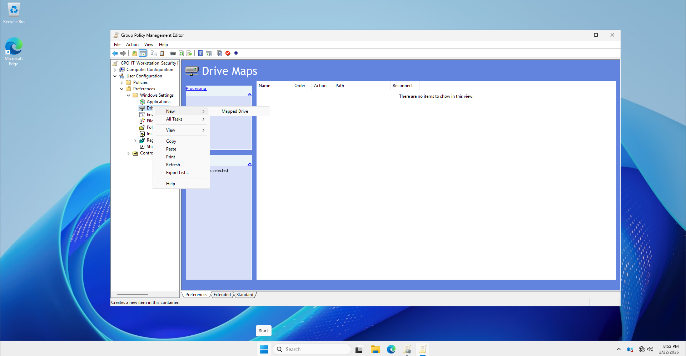
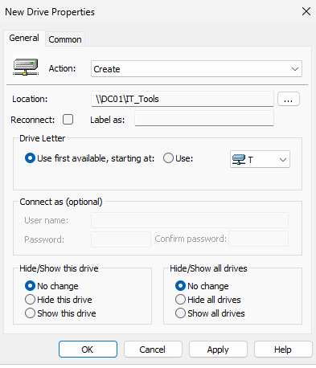
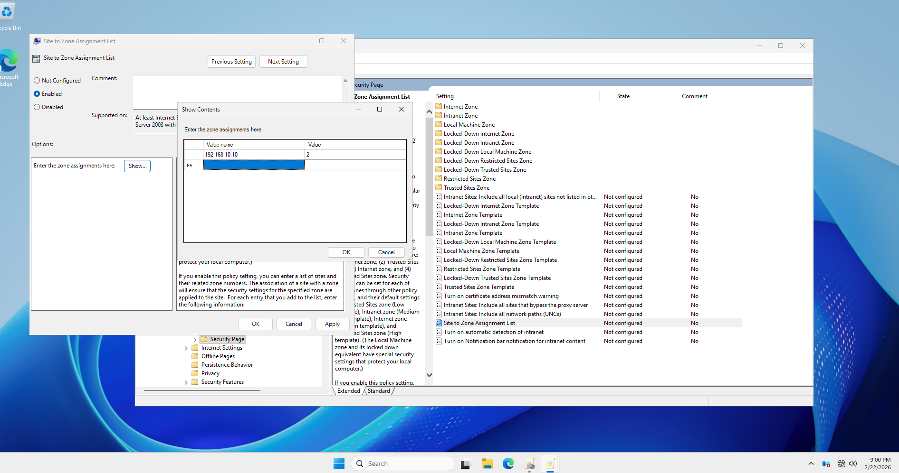
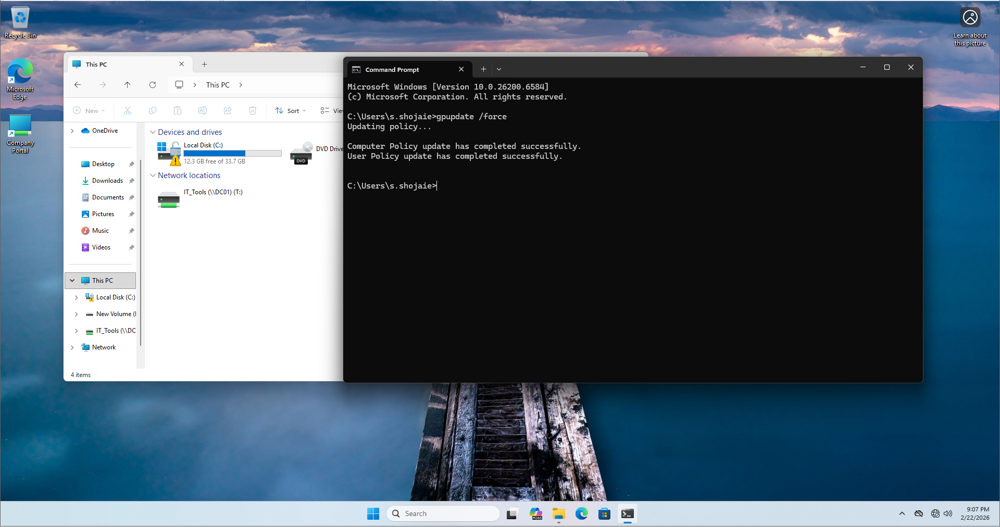

# 🛠️ Step-by-Step Implementation: Scenario 02 (Resource Automation)

## 📋 Task Overview
- **Objective:** Automatically map a Network Drive (T:) and configure Internet Explorer Trusted Sites.
- **Target User:** `s.shojaies` (IT_Staff Group)
- **Target OU:** `IT_Department`

---

## ⚙️ Execution Steps

### Step 1: Create a New GPO
1. Open **Group Policy Management**.
2. Right-click on the **IT_Department** OU and select **"Create a GPO in this domain, and Link it here..."**.
3. Name it: `GPO_IT_Resource_Automation`.

### Step 2: Configure Network Drive Mapping (T: Drive)
1. Right-click the GPO and select **Edit**.
2. Navigate to: `User Configuration` > `Preferences` > `Windows Settings` > `Drive Maps`.
3. Right-click in the empty space and select **New** > **Mapped Drive**.



4. Configure the following:
   - **Action:** `Update`
   - **Location:** `\\DC01\IT_Tools` (Ensure this folder is shared on your server).
   - **Reconnect:** ✅ Checked.
   - **Label as:** `IT Department Tools`
   - **Drive Letter:** Use **T**.
5. Click **OK**.



### Step 3: Configure Trusted Sites (Server IP)
1. In the same GPO Editor, navigate to: `User Configuration` > `Policies` > `Administrative Templates` > `Windows Components` > `Internet Explorer` > `Internet Control Panel` > `Security Page`.
2. Find the setting: **Site to Zone Assignment List**.
3. Set it to **Enabled**, then click the **Show...** button.
4. Add the following entry:
   - **Value Name:** `192.168.10.10` (Your Server IP)
   - **Value:** `2` (Number 2 represents the 'Trusted Sites' zone).
5. Click **OK**.



### Step 4: Apply Security Filtering
1. Go back to the **GPMC** main window.
2. Select the `GPO_IT_Resource_Automation` GPO.
3. In the **Scope** tab, remove `Authenticated Users` and add the `IT_Staff` group.
4. (Remember to add `Authenticated Users` with **Read** access in the **Delegation** tab as we did in Scenario 01).


## 🧪 Verification & Testing

### 1. Refresh Policy
On the client machine (s.shojaies):
```cmd
gpupdate /force
```


As you can see, the GPO is working perfectly. The network drive has been successfully mapped with the exact name we specified ('IT Department Tools'). This confirms that the drive mapping preference is correctly targeted and deployed to the user's environment.



