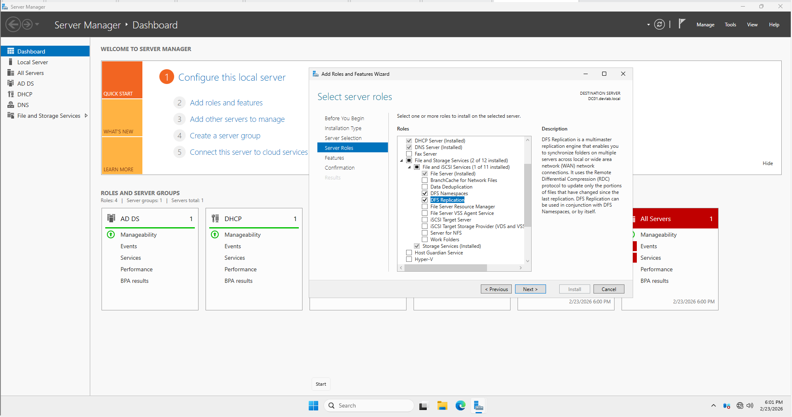
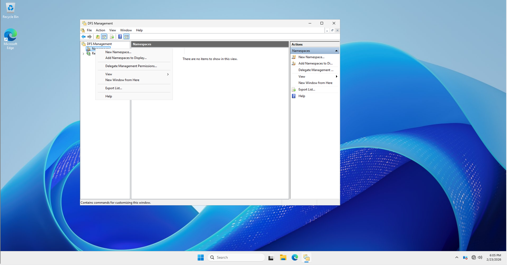
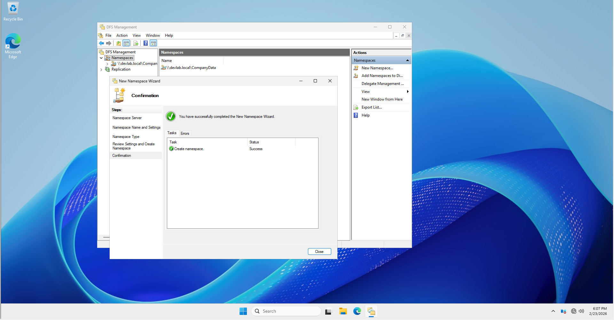
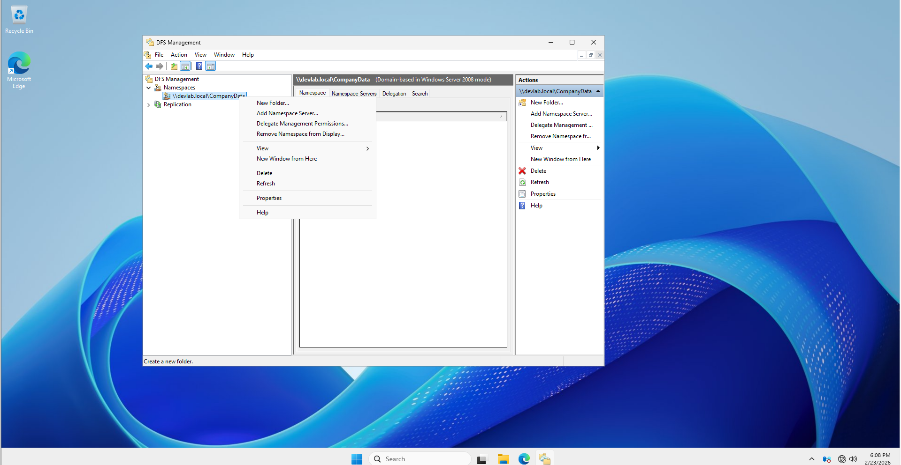
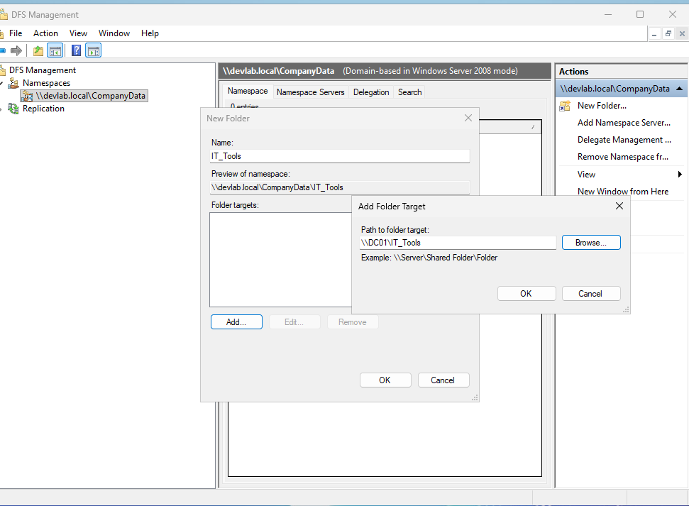
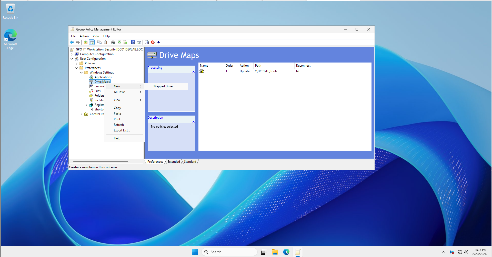
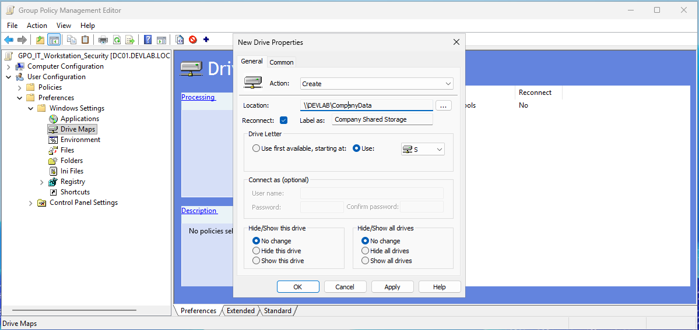
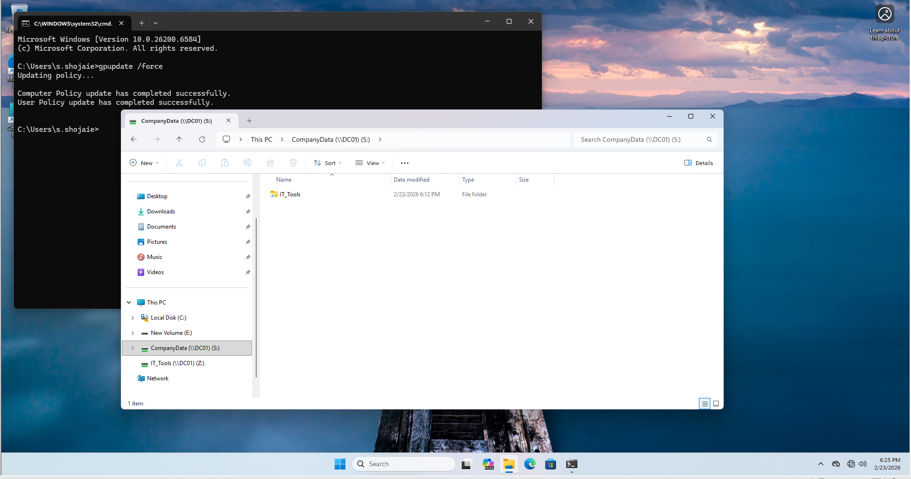

# 🛠️ Step-by-Step Implementation: Scenario 1 (DFS & High Availability)

## 📋 Task Overview
- **Objective:** Create a unified path (`\\devlab.local\CompanyData`) and replicate data between servers.
- **Tools:** DFS Namespaces, DFS Replication, Group Policy Management.

---

## ⚙️ Execution Steps

### Step 1: Install DFS Roles
*Run this on both Domain Controllers/File Servers (`DC01` and `DC02`).*

1.  Open **Server Manager** > **Manage** > **Add Roles and Features**.
2.  Navigate to **Server Roles** > **File and Storage Services** > **File and iSCSI Services**.
3.  Check both **DFS Namespaces** and **DFS Replication**.

4.  Complete the wizard and install.

### Step 2: Create a Domain-Based Namespace
1.  Open **DFS Management** from Administrative Tools.
2.  Right-click **Namespaces** > **New Namespace**.

3.  **Server:** Type `DC01` (Your primary server).
4.  **Name:** Type `CompanyData`.
5.  **Type:** Select **Domain-based namespace**.
6.  Click **Create**. Now your entry point is `\\devlab.local\CompanyData`.

### Step 3: Add Folder Targets
1.  Right-click your new namespace > **New Folder**.

2.  **Name:** Type `IT_Tools`.
3.  **Folder Targets:** Click **Add** and point it to the local shared folder (e.g., `\\DC01\IT_Tools`).
4.  Repeat this for other departments like `Sales` or `HR`.

### Step 4: Configure DFS Replication (DFSR)
1.  In **DFS Management**, right-click the folder you created (e.g., `IT_Tools`) and select **Add Folder Target**.
2.  Point it to the share on your **second server** (e.g., `\\DC02\IT_Tools`).
3.  A prompt will appear asking to create a **Replication Group**. Click **Yes**.
4.  Follow the wizard:
    - **Primary Member:** Select `DC01`.
    - **Topology:** Select **Full Mesh**.
    - **Bandwidth:** Select **Full**.
5.  Click **Create**. Data will now sync between both servers.

### Step 5: Map the S: Drive via GPO
1.  Open **Group Policy Management**.
2.  Edit your existing GPO or create a new one: `GPO_DFS_MappedDrives`.
3.  Navigate to: `User Configuration` > `Preferences` > `Windows Settings` > `Drive Maps`.

4.  Create a **New Mapped Drive**:
    - **Action:** `Update`
    - **Location:** `\\devlab.local\CompanyData`
    - **Drive Letter:** `S`
    - **Label:** `Company Shared Storage`

5.  Link the GPO to the `IT_Department` OU.

## 🧪 Verification & Testing

### 1. Unified Access Test
- **Action:** On the client machine, press `Win + R` and type `\\devlab.local\CompanyData` or `gpupdate /force`.
- **Expected Result:** You should see all department folders in one place.

### 2. High Availability Test (The "Chaos" Test)
- **Action:** Shutdown your primary server (`DC01`).
- **Action:** Try to access the `S:` drive from the client.
- **Expected Result:** The files should still be accessible because DFS automatically redirects the user to `DC02`.
