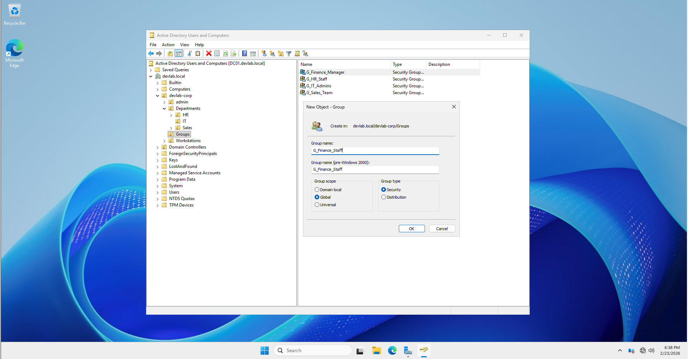
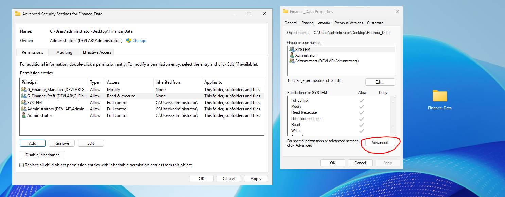
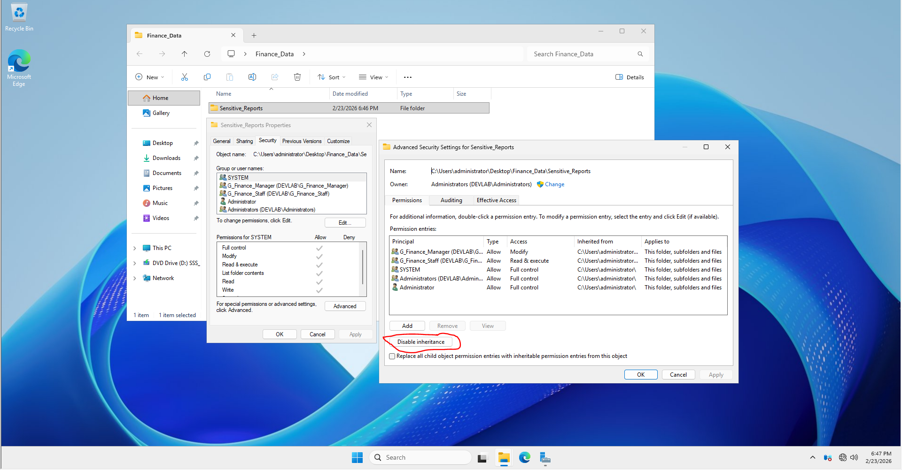

# 🛠️ Step-by-Step Implementation: Scenario 2 (Security & NTFS Hardening)

## 📋 Task Overview
- **Objective:** Implement Least Privilege access, manage NTFS inheritance, and configure a secure FTPS server.
- **Focus:** Group-based permissions and User Isolation.

## ⚙️ Execution Steps

### Step 1: Create Security Groups (AGDLP Method)
*Before setting permissions, we must create the necessary groups in Active Directory.*

1.  Open **Active Directory Users and Computers**.
2.  Navigate to your `IT_Department` (or a dedicated Groups OU).
3.  Create two Global Security Groups:
    - `G_Finance_Managers`
    - `G_Finance_Staff`

4.  Add appropriate users to these groups (e.g., add `sa.shojaies` to `G_Finance_Managers`).

### Step 2: Configure Group-Based NTFS Permissions
1.  Create a folder named `Finance_Data` on your server.
2.  Right-click the folder > **Properties** > **Security** tab > **Advanced**.
3.  **Clean up:** Remove any individual user accounts listed directly. 
4.  **Add Groups:**
    - Click **Add** > **Select a principal** > type `G_Finance_Managers` > Set to **Modify**.
    - Click **Add** > **Select a principal** > type `G_Finance_Staff` > Set to **Read & Execute**.
5.  Click **OK**.

### Step 3: Disable Inheritance for Sensitive Folders
1.  Inside `Finance_Data`, create a subfolder named `Sensitive_Reports`.
2.  Right-click `Sensitive_Reports` > **Properties** > **Security** > **Advanced**.
3.  Click **Disable inheritance**.

4.  Choose **"Convert inherited permissions into explicit permissions on this object"** (This allows you to keep current permissions but break the link to the parent folder).
5.  Remove any groups (like `G_Finance_Staff`) that should not have access to this specific sensitive folder.

### Step 4: Configure Secure FTP (FTPS) with User Isolation
1.  **Install Role:** Open Server Manager > Add Roles > Web Server (IIS) > **FTP Server** (ensure **FTP Service** and **FTP Extensibility** are checked).
2.  **Create FTP Site:**
    - Open **IIS Manager**.
    - Right-click **Sites** > **Add FTP Site**.
    - **Name:** `External_Partners` | **Physical Path:** `C:\FTP_Root`.
3.  **Binding and SSL:**
    - Select **Require SSL** (to ensure it is FTPS, not plain FTP).
    - Select your server's SSL certificate.
4.  **Authentication & Isolation:**
    - Select **Basic Authentication**.
    - Go to **FTP User Isolation** settings and select **"User name directory (disable global virtual directories)"**.
    - This ensures `PartnerA` cannot see `PartnerB`'s files.

## 🧪 Verification & Testing

### 1. NTFS Least Privilege Test
- **Action:** Log in as a member of `G_Finance_Staff`.
- **Test:** Try to delete or edit a file in `Finance_Data`.
- **Expected Result:** Access Denied. You should only be able to read files.

### 2. Inheritance Check
- **Action:** Check the effective access for a high-level admin on the `Sensitive_Reports` folder.
- **Expected Result:** Changes made to the `C:\` drive permissions should NOT trickle down to this folder.

### 3. FTPS Connection Test
- **Action:** Use a client like **FileZilla**.
- **Settings:** Use `Require implicit FTP over TLS`.
- **Expected Result:** Connection successful and the user is locked into their specific home folder.

