# Implementation Guide: Securing Internal Websites (Windows & Linux Integration)

This document outlines the procedure for deploying an Internal Enterprise Root CA, issuing certificates for IIS, and preparing them for Linux-based NGINX services using a Windows-first approach.

---

## Step 1: Deploying the Internal Enterprise Root CA
To establish trust across the `devlab.local` domain, we must install Active Directory Certificate Services (AD CS).

1.  **Install Role:** Open **Server Manager** > **Add Roles and Features**. 

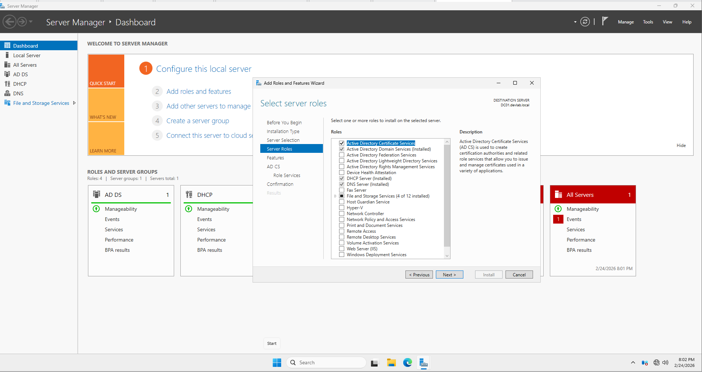

Select **Active Directory Certificate Services**.

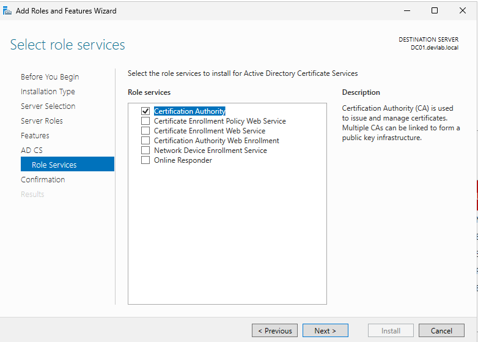

2.  **Role Services:** Ensure **Certification Authority** is checked.
3.  **Post-Deployment Configuration:**
    * **Setup Type:** Select **Enterprise CA** (This integrates with Active Directory).

    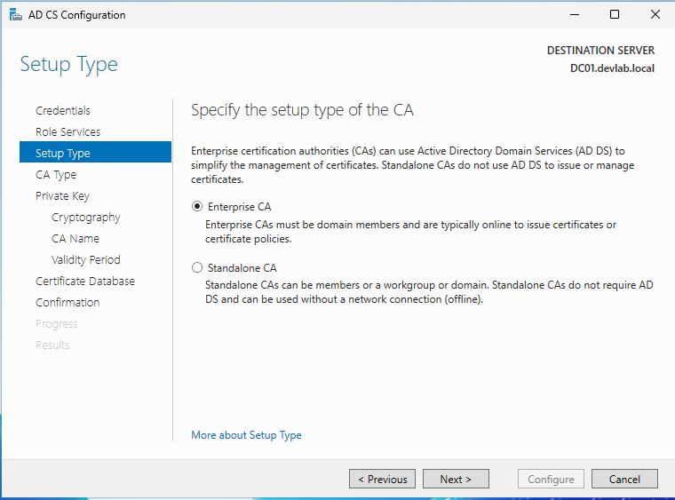

    * **CA Type:** Select **Root CA**.

    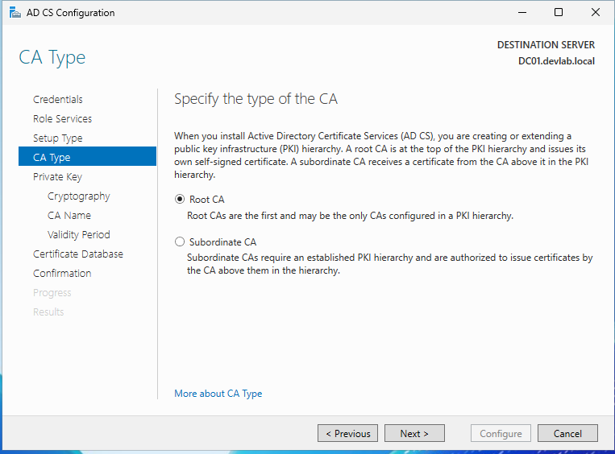

    * **Private Key:** Select **Create a new private key**.
   
    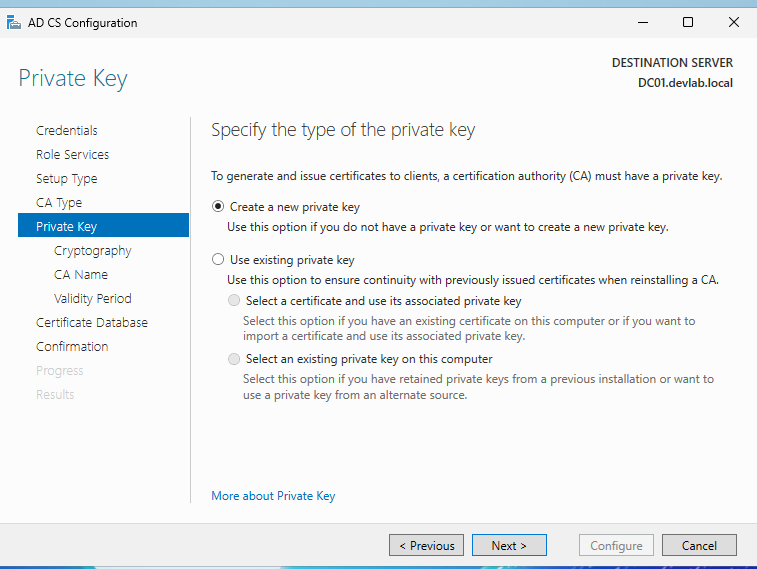
    
    * **Cryptography:** Use **RSA** with a key length of **2048** (Standard for compatibility).

    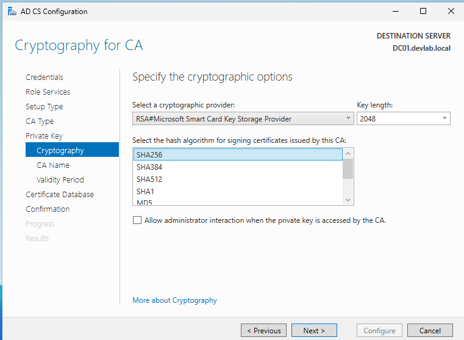


    * **CA Name:** Set a common name (e.g., `devlab-DC01-CA`).
    * **Validity:** Set to **5 or 10 years**.
4.  **Finish:** Click **Configure** to finalize the CA installation.

---

## Step 2: Create a Deployable Web Server Template
The default Web Server template does not allow Private Key export. We must create a custom version to support our Linux requirements.

1.  Open the **Certification Authority** console.
2.  Right-click **Certificate Templates** and select **Manage**.

    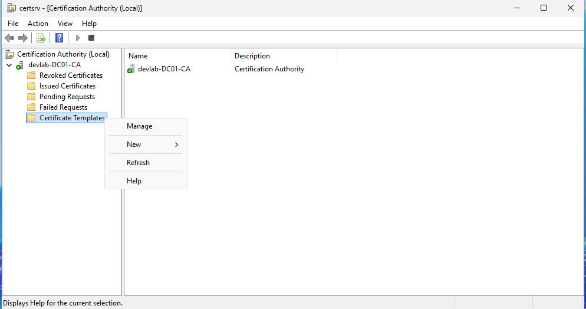

3.  Right-click the **Web Server** template and choose **Duplicate Template**.
4.  **General Tab:** Set Template Display Name to `Internal-SSL-Exportable`.
5.  **Request Handling Tab:** Check the box **"Allow private key to be exported"**. (Crucial for Scenario Requirement #3).
6.  **Security Tab:** Grant **"Enroll"** permissions to `Domain Computers` or specific server groups.
7.  **Publish:** Back in the CA console, right-click **Certificate Templates** > **New** > **Certificate Template to Issue**. Select `Internal-SSL-Exportable`.

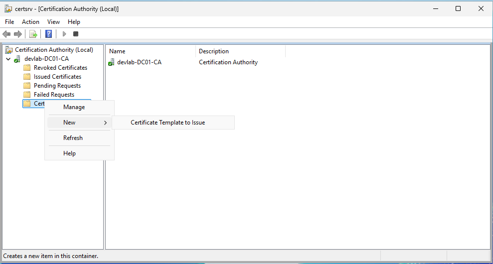

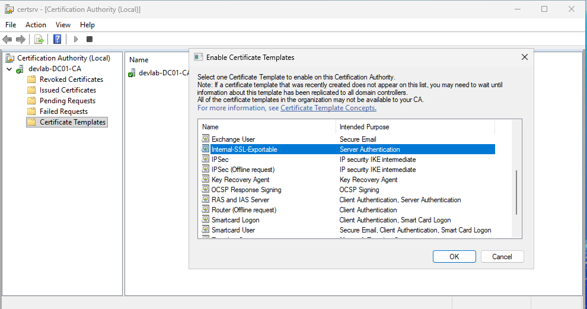

---

## Step 3: Requesting the Certificate for panel.devlab.local
We will now use the Windows MMC to request the certificate for our internal site.

1.  On the target Windows server (or management workstation), open **MMC** and add the **Certificates (Local Computer)** snap-in.

    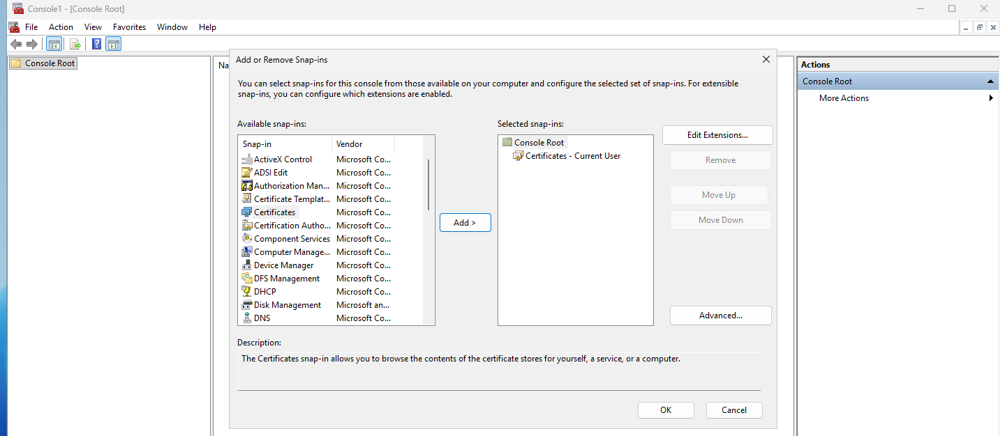

2.  Navigate to **Personal** > **Certificates**.
3.  Right-click > **All Tasks** > **Request New Certificate**.

    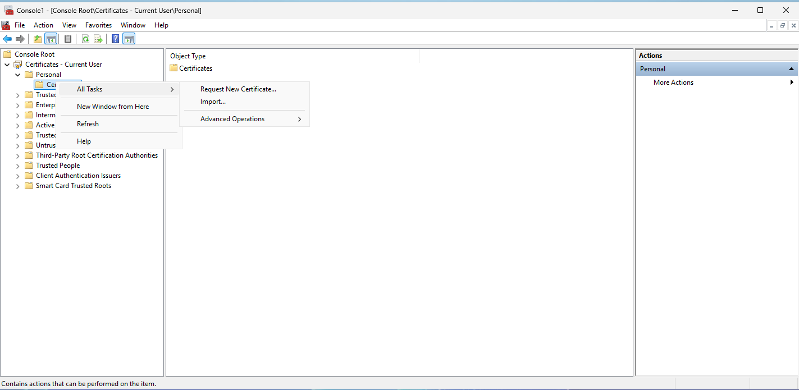
    
4.  Select the `Internal-SSL-Exportable` template.
5.  Click the **"More information is required"** warning link:
    * **Subject Tab:** Under "Subject Name", set Type to **Common Name** and Value to `panel.devlab.local`.
    * **Alternative Name:** (Optional) Add a **DNS** type value for `panel.devlab.local` to ensure modern browser compatibility.
6.  Click **Enroll**.

---

## Step 4: Exporting and Converting for Linux (OpenSSL)
Since we cannot buy a public SSL, we will export the internal certificate from the Windows store and convert it for NGINX.

1.  **Export PFX:** In the MMC, right-click the new certificate > **All Tasks** > **Export**. 
    * Select **"Yes, export the private key"**.
    * Select **PFX** format and set a password (e.g., `Password123`).
2.  **OpenSSL Conversion:** Transfer the `.pfx` file to a machine with OpenSSL installed (or use OpenSSL for Windows). Run:

```powershell
# 1. Extract the Private Key
openssl pkcs12 -in panel.pfx -nocerts -out panel.key -nodes

# 2. Extract the Certificate
openssl pkcs12 -in panel.pfx -clcerts -nokeys -out panel.crt