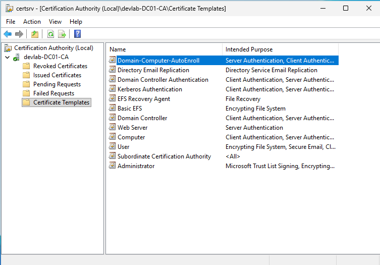
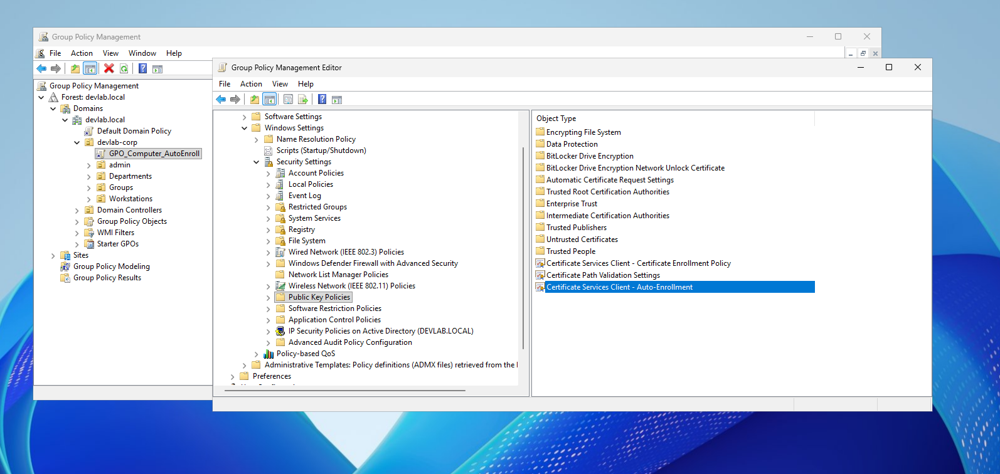
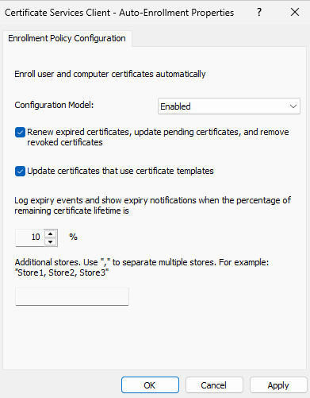

# Scenario 2: Passwordless Authentication and Automated Computer Enrollment

## Current Status
Our network has grown significantly. To maintain security and efficiency, we need company computers to identify themselves via digital certificates. Manual installation is no longer feasible for hundreds of machines.

## Requirements
1. **Template Design:** Create a computer-specific template with Auto-enrollment permissions.
2. **Implementation:** Use Group Policy (GPO) to automate the request and installation process.
3. **Lifecycle Management:** Automate the renewal process to prevent certificate expiration issues.

---

## Step 1: Create the Certificate Template
We must create a template that allows Active Directory to automatically provide identity information for the computers.

### Instructions:
1. **Open Management Console:** Launch the **Certification Authority** console, right-click **Certificate Templates**, and select **Manage**.
2. **Duplicate Existing Template:** Find the **Computer** template, right-click it, and choose **Duplicate Template**.
3. **General Tab:** - Set **Template Display Name** to `Domain-Computer-AutoEnroll`.
   - Set the **Validity period** (e.g., 2 years) and **Renewal period** (e.g., 6 weeks).
4. **Subject Name Tab:** Select **"Build from this Active Directory information"**. This ensures the certificate is automatically issued based on the computer's DNS name.
5. **Security Tab (Critical):** - Add the **Domain Computers** group.
   - Grant the following permissions: **Read**, **Enroll**, and **Auto-enroll**.
6. **Publish the Template:** - Go back to the CA console.
   - Right-click **Certificate Templates** > **New** > **Certificate Template to Issue**.
   - Select `Domain-Computer-AutoEnroll`.

   

---

## Step 2: Implement Auto-enrollment via Group Policy (GPO)
The GPO acts as the "instruction manual" telling computers to contact the CA.

### Instructions:
1. **Open Group Policy Management:** Run `gpmc.msc`.
2. **Create/Edit GPO:** Create a new GPO named `GPO_Computer_AutoEnroll` and link it to your target OU or the root domain.
3. **Navigate to Public Key Policies:**
   `Computer Configuration` > `Policies` > `Windows Settings` > `Security Settings` > `Public Key Policies`

    

4. **Configure Auto-Enrollment:**
   - Double-click **Certificate Services Client - Auto-Enrollment**.
   - Set **Configuration Model** to **Enabled**.
   - Check the box: **"Renew expired certificates, update pending certificates, and remove revoked certificates"**.
   - Check the box: **"Update certificates that use certificate templates"**.

    

5. **Force Update:** Run `gpupdate /force` on a client machine to trigger the policy.

## Step 3: Automate Lifecycle Management
By checking the renewal boxes in the GPO, the lifecycle management is now fully automated.

### Benefits:
- **Zero-Touch Renewal:** Certificates are renewed automatically before they expire without admin intervention.
- **Revocation Management:** If a certificate is revoked, the GPO ensures it is cleaned up from the client's store.
- **Consistency:** Every domain-joined machine is guaranteed to have a valid identity certificate.

## Verification
To verify that the automation is working:
1. Log into a domain-joined client machine.
2. Open `mmc.exe` and add the **Certificates (Local Computer)** snap-in.
3. Check **Personal > Certificates**. 
4. You should see a new certificate issued to the computer by your CA using the `Domain-Computer-AutoEnroll` template.