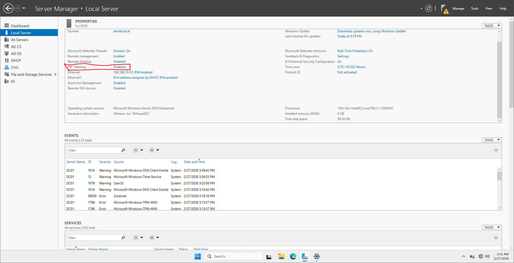
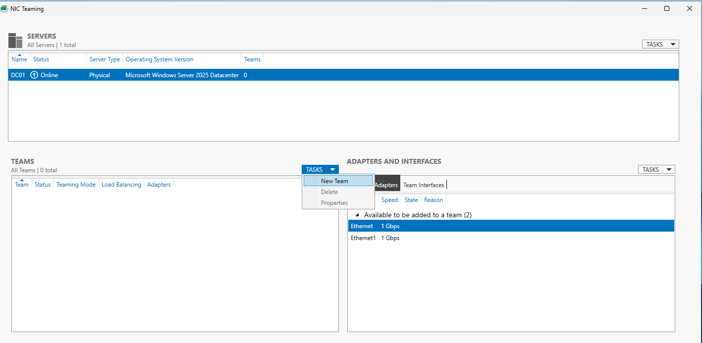
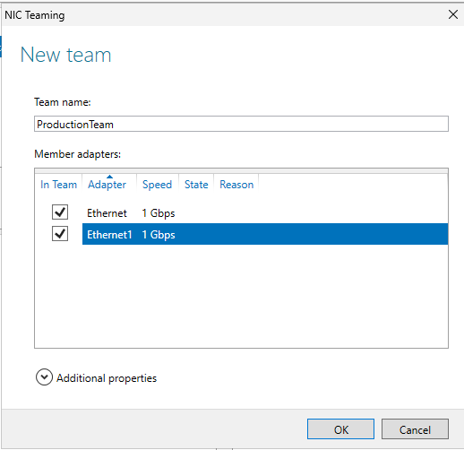
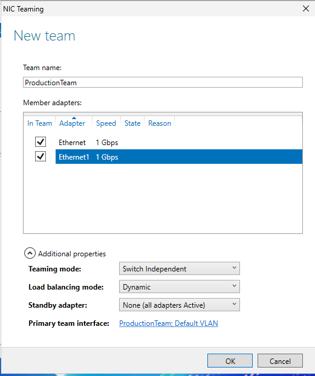
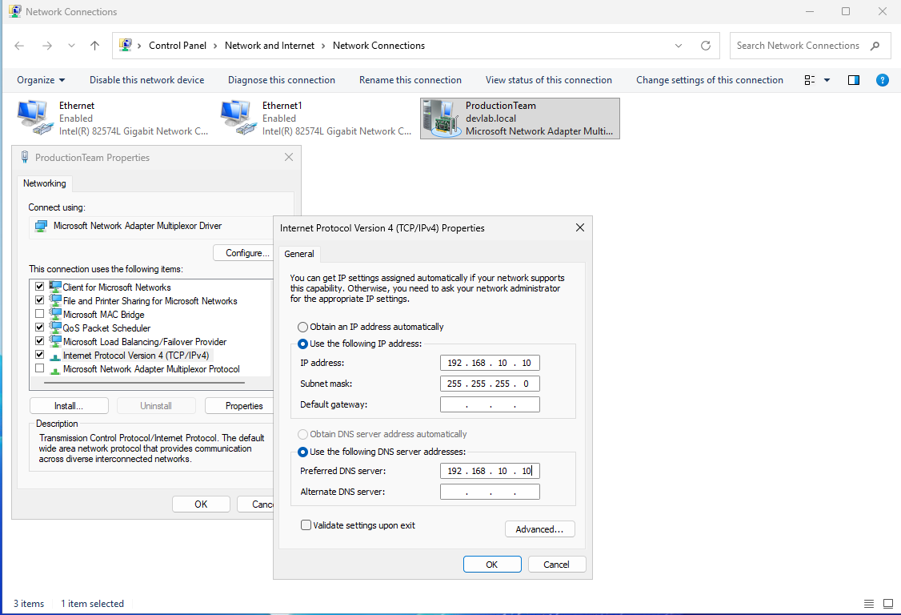
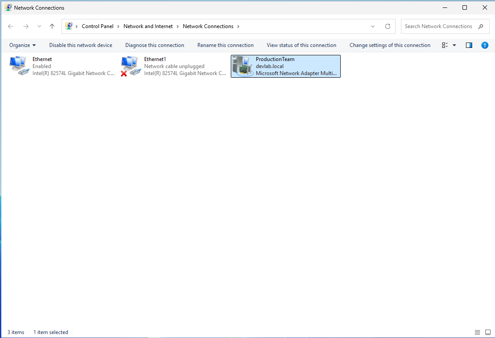
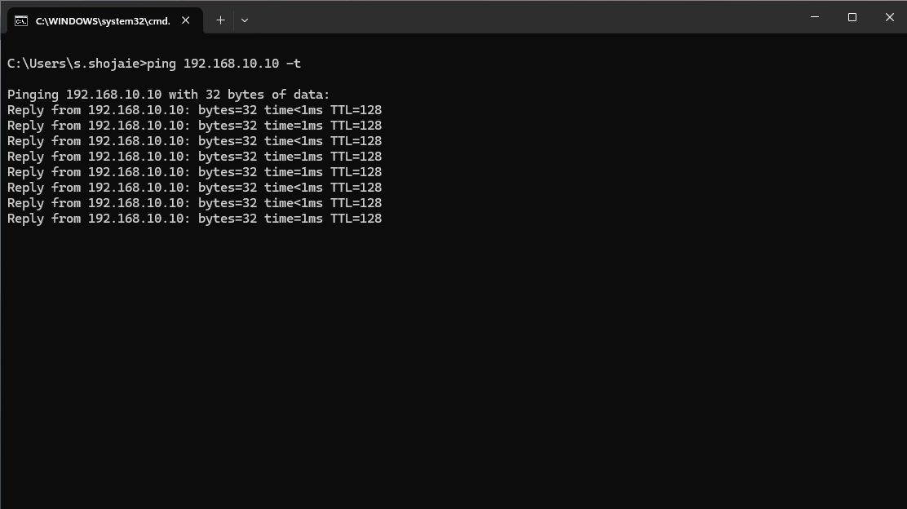

# Step-by-Step Implementation: NIC Teaming via Server Manager 

This guide outlines the process of configuring NIC Teaming using the **Server Manager** interface on **Windows Server 2025**.

## Phase 1: Accessing NIC Teaming Settings
1. Open **Server Manager** from the Taskbar.
2. Click on **Local Server** in the left-hand navigation pane.
3. Locate the **NIC Teaming** property. Click on the word **Disabled** to open the management console.

## Phase 2: Creating the New Team
1. In the **NIC Teaming** window, navigate to the **TEAMS** section (bottom left).
2. Click **Tasks** -> **New Team**.

3. **Team Name:** Enter `ProductionTeam`.
4. **Member Adapters:** Select both `Ethernet` and `Ethernet 1`.

## Phase 3: Configuring Teaming Properties
1. Click **Additional properties** to expand the advanced setup.
2. **Teaming mode:** Select `Switch Independent` (allows connection to different physical switches).
3. **Load balancing mode:** Select `Dynamic` (optimizes traffic distribution).
4. **Standby adapter:** Select `None` (ensures both NICs are active simultaneously).
5. Click **OK**.

## Phase 4: Verification of Team Interface Creation
**This is the most critical step.** You must verify that the operating system has successfully created the new logical "Team" interface:

1. Open the **Run** dialog (`Win + R`), type `ncpa.cpl`, and hit Enter.
2. **Confirm Team Existence:** You should now see a new network adapter named **"Microsoft Network Adapter Multiplexor Driver"** or simply **"ProductionTeam"**.
3. **Status Check:** The original `Ethernet` and `Ethernet 1` will now show a status like "Enabled" but their protocols are handled by the Team. All IP configurations must now be applied **ONLY** to the new `ProductionTeam` adapter.

## Technical Note: Post-Teaming IP Reconfiguration

**Observation:** Upon successful creation of the `ProductionTeam`, the IP addresses previously assigned to individual physical adapters (`Ethernet` & `Ethernet 1`) were deprecated. 

**Technical Explanation:** The physical adapters now function as subordinate members of the Team. The IP stack is moved to the new **Logical Multiplexor Interface**. 

**Action Taken:** 1. The static IP configuration was migrated from the physical NICs to the logical **ProductionTeam** interface.
2. Verified that the server is reachable via its original IP address over the redundant link.

## Phase 5: Verification & Failover Test
To prove high availability to management:

1. **Continuous Ping:** Open CMD and run `ping 192.168.10.10 -t`.
2. **Simulate Failure:** - Go to **Network Connections**.
   - Right-click `Ethernet 1` and select **Disable**.
3. **Monitor Results:** - Observe the ping; it should continue without interruption (zero packet loss).
   - Check **Server Manager**; the `ProductionTeam` status will remain **Up**, though one member will show as "Failed" or "Disabled".
4. **Recovery:** Enable the NIC again and watch the Team automatically reintegrate the interface.

