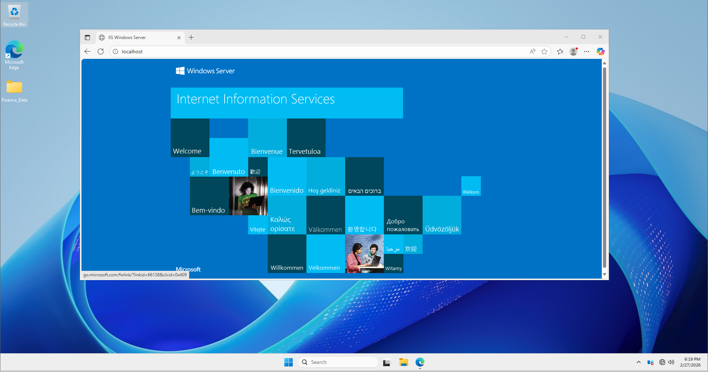

# Phase 2: Web Service Accessibility & Firewall Verification

**Objective:** Verify that the web service (IIS) is reachable on Port 80 through the newly created NIC Team and ensure that Windows Firewall rules are correctly configured.


## Step 1: Enabling the Web Server Role (IIS)
To provide a service for testing, the **Internet Information Services (IIS)** role must be active on the server.

1.  Open **Server Manager** -> **Add Roles and Features**.
2.  Select **Web Server (IIS)** and complete the installation using the default settings.
3.  **Verification:** Verify that the service is running by opening a browser on the server and typing `http://localhost`. You should see the default IIS welcome page.




## Step 2: Connectivity Testing from Client
From a remote client machine within the same network, execute the following PowerShell command to verify port accessibility across the NIC Team:

**Command:**
```powershell
Test-NetConnection -ComputerName 192.168.10.10 -Port 80
```


## Step 3: Configuring Windows Defender Firewall
If the test in Step 2 failed (**False**), a specific **Inbound Rule** must be created to allow external HTTP traffic through the firewall to reach the web service.

### Execution Steps:
1.  **Open Management Console:** Launch **Windows Defender Firewall with Advanced Security** (wf.msc).
2.  **Initiate New Rule:** In the left pane, click **Inbound Rules**, then click **New Rule...** in the **Actions** pane on the right.
3.  **Rule Type:** Select **Port** and click Next.
4.  **Protocol and Ports:** * Select **TCP**.
    * In **Specific local ports**, enter `80`.
5.  **Action:** Select **Allow the connection** and click Next.
6.  **Profile:** Ensure **Domain**, **Private**, and **Public** are all checked to guarantee access regardless of network location.
7.  **Name:** Label the rule `Allow HTTP (Port 80)` and click **Finish**.


**Verification:** After creating the rule, the status should change to a green checkmark, indicating the port is now actively listening for external requests.
